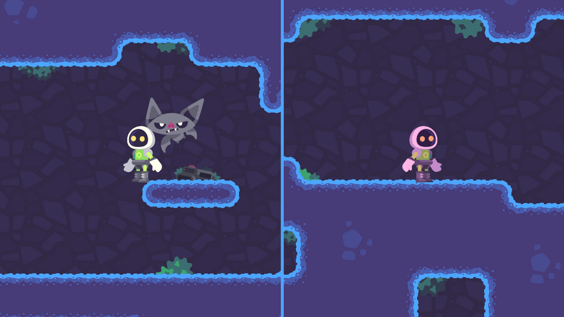

# Demo: Split-screen co-op in Godot 4

This demo shows how to set up viewports and viewport containers for split-screen co-op gameplay.

The demo uses a 2D game as an example, but it works the same in 3D.

The steps, in short:

- Use variables or resources instead of hard-coded input actions to control characters. That way, you can give each player different controls.
- Create a `SubViewport` in a `SubViewportContainer` for each player. The `SubViewportContainer` allows you to display a `SubViewport` on the screen and resize it automatically.
- Instantiate your full game level as a child of the first `SubViewport`.
- Create one camera in each `SubViewport` to render different views of your game level.
- `SubViewports` have a world property that controls what they render (`world_3d` for 3D and `world_2d` for 2D). You need to share the first viewport's world with other viewports for every view to display the same level. You can do so with code.
- Finally, to control the different cameras, you create a remote transform node as a child of each character and make it target the matching camera.

<!-- TODO link: For a detailed guide to get you started with saving and loading in Godot, check out the GDQuest Library: [Split Screen Coop](https://gdquest.com/library/split_screen_coop_godot4/) -->
